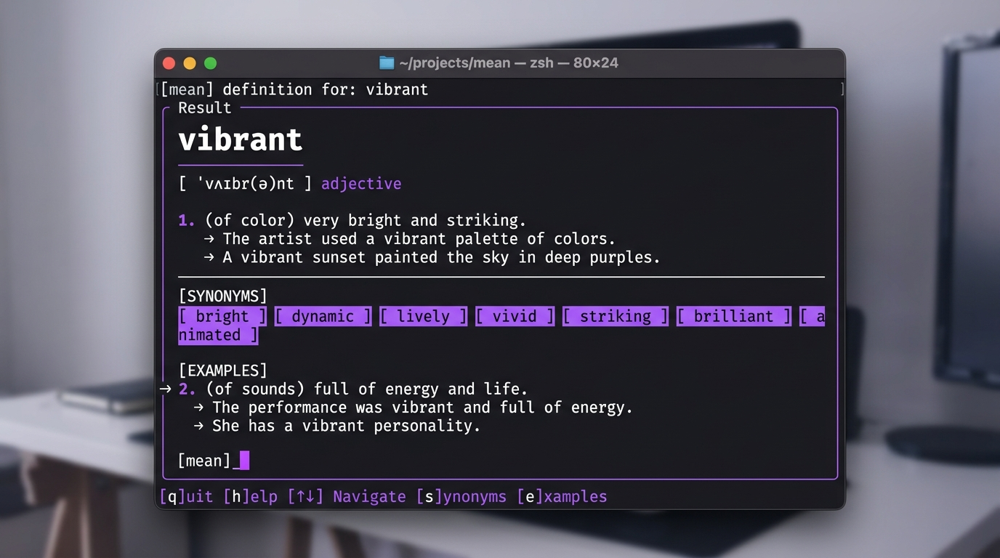

# 📖 mean — Dictionary CLI/TUI

A fast, premium, cross-platform dictionary and vocabulary builder for the terminal. Built with Go, Bubble Tea, and SQLite.



---

## ✨ Features

- **Quick CLI Mode**: Fast, single-word lookup perfect for script piping or quick queries.
- **Interactive TUI Mode**: Bubble Tea powered dashboard with scrollable panels, instant typing, and keyboard navigation.
- **Offline Cache**: First search fetches from API and caches locally in a lightweight SQLite database for instant subsequent loads.
- **Favorites & History**: Star words to build your vocabulary list and view search history.
- **Exporting**: Save definition sheets as formatted Markdown (`.md`) or plain text (`.txt`).
- **Word of the Day & Random Word**: Discover new vocabulary with `--daily` and `--random`.

---

## 🚀 Installation

### Using Go
If you have Go installed on your system:
```bash
go install github.com/umang/mean-cli/cmd/mean@latest
```

### Manual Compilation
```bash
git clone https://github.com/umang/mean-cli.git
cd mean-cli
go build -o mean ./cmd/mean
```

---

## ⌨️ Usage

### Quick Lookup
```bash
# Look up word meaning directly
mean serendipity

# Word of the Day
mean --daily

# Random Word
mean --random
```

### Interactive Dashboard (TUI)
Simply run the command with no arguments:
```bash
mean
```

#### TUI Keyboard Shortcuts
- `/` or `Ctrl + K`: Focus search bar to type a word
- `Enter`: Submit search
- `Tab`: Alternate focus between search box and results panel
- `s`: Toggle star / favorite
- `c`: Copy beautifully formatted definition sheet to system clipboard
- `p`: Play native voice pronunciation audio aloud
- `↑ / ↓` or Mouse Wheel: Scroll content
- `Esc`: Defocus search box / Quit TUI
- `q`: Quit

### Study & Active Recall Modes
```bash
# Launch interactive vocabulary quiz game
mean quiz

# Launch active recall flashcards study session
mean flashcards (or 'mean fc')
```

#### Flashcard Shortcuts
- `Space` / `Enter`: Flip card to reveal/hide details
- `→` / `n` / `l`: Next card
- `←` / `h`: Previous card
- `s`: Toggle star status
- `p`: Play pronunciation audio
- `q` / `Esc`: Exit study mode

#### Quiz Shortcuts
- `Enter`: Submit guess / go to next card
- `p`: Play pronunciation audio (only after guessing)
- `q` / `Esc`: Exit quiz

### Managing Vocabulary & Settings
```bash
# Toggle a word in favorites
mean star ephemeral

# List all favorites
mean favorites

# Print search history
mean history

# Export last looked up word
mean export md
mean export txt

# Clear cache database
mean cache clear
```

---

## 🛠️ Stack & Architecture

- **Go 1.22+**
- **Bubble Tea + Lip Gloss**: Terminal UI framework and design styling
- **Cobra**: Command line interface framework
- **Pure Go SQLite (`modernc.org/sqlite`)**: Zero-dependency SQLite driver (allows seamless cross-compilation without CGO/gcc)

---

## 📄 License
MIT License. Open source and free to use.
